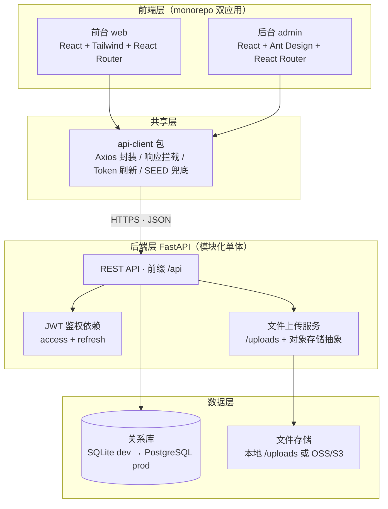
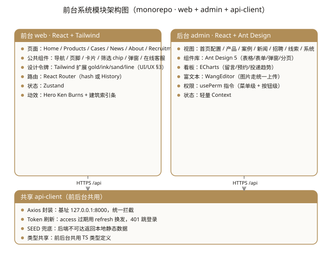
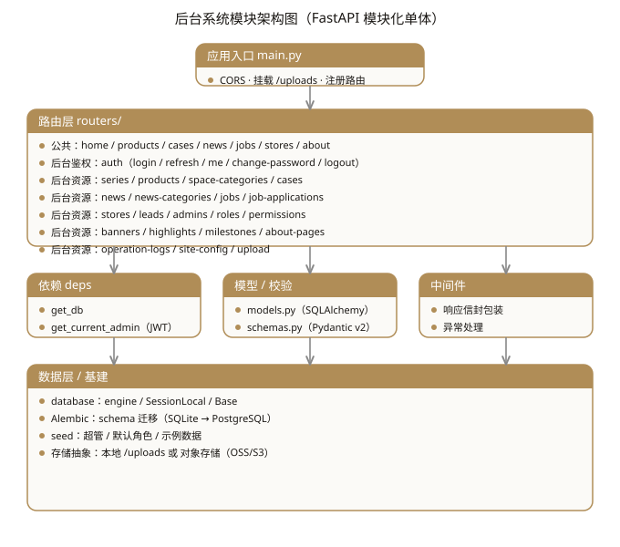
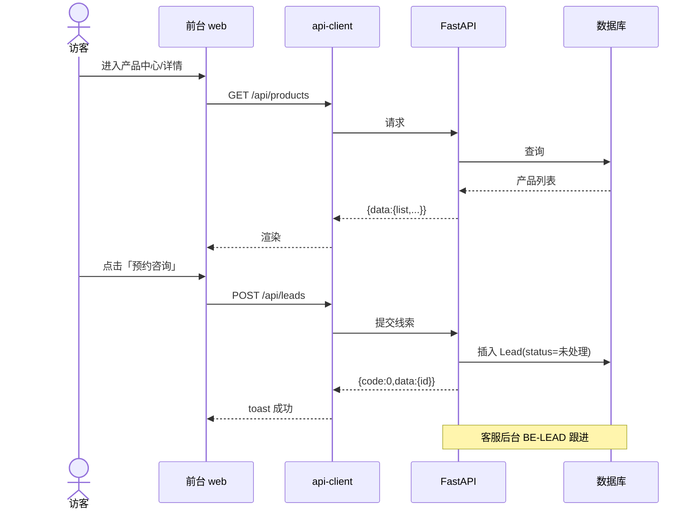
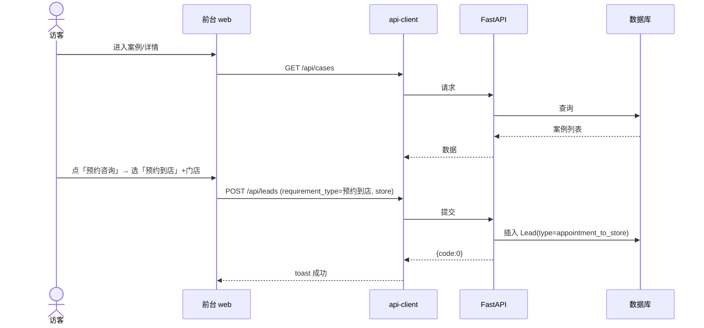
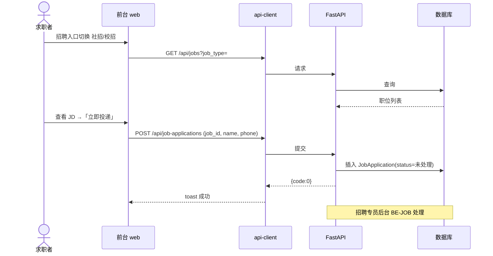
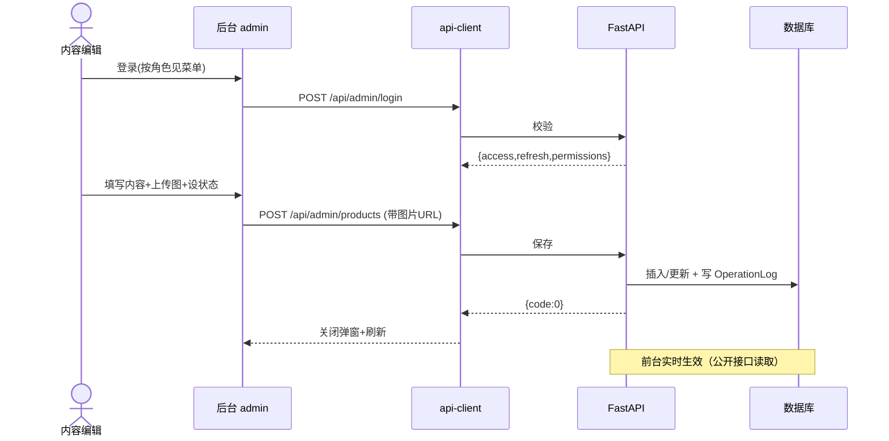

# 开发技术文档 · TP 全屋家居企业官网与后台管理系统

> 文档版本：v1.0（对应 PRD v1.2、UI/UX 规范 v1.1）
> 撰写视角：Software Architect（架构决策优先、trade-off 透明）
> 图示说明：本文档中的 ER 图与系统/模块架构图由 diagram-builder 技能生成并导出为 **SVG 图片**（存放于 `diagrams/` 目录，可直接预览）；业务时序图以 Mermaid 代码块呈现（可在支持 Mermaid 的查看器中渲染）。

| 项 | 内容 |
|----|------|
| 项目名称 | TP 全屋家居企业官网与后台管理系统 |
| 前端技术 | React（前台 web + 后台 admin 双应用，monorepo）+ Tailwind / Ant Design |
| 后端技术 | FastAPI + SQLAlchemy + Alembic + JWT |
| 数据库 | SQLite（开发）→ PostgreSQL（生产），双形态类型映射 |
| 事实源 | PRD v1.2（要做什么）+ UI/UX 规范 v1.1（长什么样/怎么交互） |
| 文档范围 | 仅描述"怎么建"，不重新设计产品/视觉，零风格漂移 |

---

## 第 1 章 概述与阅读指引

### 1.1 文档目标与读者

| 读者 | 关注章节 |
|------|----------|
| 前端工程师（web / admin） | 第 2、3、6、7、9、10、11 章 |
| 后端工程师（FastAPI） | 第 2、3、5、7、8、9、10、11 章 |
| 技术负责人 / 架构师 | 第 2 章（ADR）、第 4 章（数据模型）、第 8 章（权限） |
| 测试 | 第 7 章（接口）、第 11 章（验收对齐） |

### 1.2 与 PRD / UI/UX 的边界

| 文档 | 本技术文档如何使用 |
|------|-------------------|
| PRD §8 技术架构 | 第 2、3 章技术栈与部署来源 |
| PRD §9 数据模型 | 第 4 章数据库设计（字段照搬/推导） |
| PRD §5/§6 前后台功能 | 第 7 章接口、第 5/6 章任务拆分 |
| PRD §10 业务流程 | 第 10 章时序图 |
| PRD §12 验收标准 | 第 11 章逐项对齐 |
| UI/UX §3 令牌 / §4 组件 / §5-6 页面 / §7-9 交互 | 第 6 章前端工程规范（设计令牌落地、组件映射、a11y/响应式） |

### 1.3 术语表

| 术语 | 含义 |
|------|------|
| web | 前台展示应用（React + Tailwind） |
| admin | 后台管理应用（React + Ant Design） |
| api-client | 前后台共享的请求层包（Axios 封装） |
| Lead | 线索表，承载在线留言 / 预约到店 / 在线客服咨询 |
| SpaceCategory | 空间场景分类，产品与案例共用（scope 区分） |
| RBAC | 基于角色的访问控制（Role ↔ Permission） |

---

## 第 2 章 技术架构总览

### 2.1 系统架构图（diagram-builder 生成）

### 2.2 架构决策记录（ADR）

| ADR | 决策 | 取舍（得到 / 失去） |
|-----|------|---------------------|
| ADR-001 前端形态 | monorepo 拆 `web` / `admin` / `packages/api-client` | ✅ 公共站轻量、admin 不污染前台样式、独立部署、权限隔离 ✖️ 初期多 monorepo 配置（pnpm workspace） |
| ADR-002 后端形态 | FastAPI **模块化单体**（router 分模块，非微服务） | ✅ 团队小、领域清晰、运维简单、Alembic 单库迁移 ✖️ 未来单模块独立扩展需重构（本阶段无此诉求） |
| ADR-003 数据库 | SQLite(dev) → PostgreSQL(prod)，字段表双类型，Alembic 迁移 | ✅ 起步零运维、生产稳健 ✖️ 需维护两套类型映射、迁移脚本 |
| ADR-004 认证与权限 | JWT 双 token + RBAC（菜单级 + 按钮级） | ✅ 对齐 PRD §6.1/BE-AUTH-02，无状态可水平扩展 ✖️ 需 refresh 轮换与黑名单/续期逻辑 |
| ADR-005 前后端契约 | 统一响应信封 `{code,message,data}` + 分页 `{list,total,page}` + 错误码表 + `/api` 前缀 | ✅ 解耦、可生成 OpenAPI、前端统一拦截 ✖️ 前端需统一响应处理层 |
| ADR-006 API 版本化 | **不加版本号**，直接使用 `/api/...` | ✅ 减少复杂度，PRD 未要求 ✖️ 未来 Breaking 变更需一次性升 `/api/v1`（已在 Open Questions 标注） |
| ADR-007 文件存储 | 本地 `/uploads` + 对象存储抽象接口（开发本地、生产切 OSS/S3） | ✅ 不绑定具体云厂商，切换成本低 ✖️ 需定义存储抽象层与迁移脚本 |
| ADR-008 富文本 / 状态 | 后台富文本用 WangEditor（PRD §15 Q2 已确认）；状态管理用 Zustand | ✅ 与 PRD 决策一致、轻量 ✖️ Zustand 需约定 store 拆分规范 |

### 2.3 技术栈映射

| 层 | 选型 | 说明 / 对应 PRD |
|----|------|------------------|
| 前台框架 | React 18 + Vite + React Router | PRD §8.3 |
| 前台样式 | Tailwind CSS（扩展 `tailwind.config` 对齐 UI/UX §3 令牌） | UI/UX §3 |
| 后台框架 | React 18 + Vite + Ant Design 5 | PRD §8.3 |
| 后台图表 | ECharts（看板趋势图，色值见 UI/UX §3.7） | UI/UX §3.7 |
| 富文本 | WangEditor（图片粘贴/拖拽上传走统一上传接口） | PRD §15 Q2 |
| 状态管理 | Zustand（前台）/ 轻量 Context（后台） | ADR-008 |
| HTTP | Axios（封装于 `api-client`） | PRD §8.3 |
| 后端框架 | FastAPI | PRD §8.2 |
| ORM | SQLAlchemy 2.0 + Alembic | PRD §8.2 |
| 校验 | Pydantic v2（schemas） | PRD §8.2 |
| 鉴权 | python-jose + passlib(bcrypt) + JWT 双 token | PRD §8.2 |
| 数据库 | SQLite(dev) / PostgreSQL(prod) | PRD §8.4 |
| 部署 | 后端 Docker；前端静态资源 CDN / Nginx | PRD §8.5 |

### 2.4 部署拓扑

| 环境 | 配置 |
|------|------|
| 开发 | SQLite + 本地 `/uploads` + `127.0.0.1:8000`（避 Windows localhost→IPv6） |
| 测试 | SQLite/PG + 对象存储测试桶 |
| 生产 | PostgreSQL + 对象存储 + Nginx 反代 + HTTPS + 前端 CDN |

### 2.5 前台系统模块架构图（diagram-builder 生成 SVG）

### 2.6 后台系统模块架构图（diagram-builder 生成 SVG）

---

## 第 3 章 工程化与目录约定

### 3.1 Monorepo 目录结构

| 路径 | 职责 |
|------|------|
| `apps/web` | 前台展示应用（React + Tailwind） |
| `apps/admin` | 后台管理应用（React + Ant Design） |
| `packages/api-client` | 共享请求层（Axios 封装、类型、SEED 兜底） |
| `backend` | FastAPI 服务（见第 5 章结构） |
| `deploy` | Dockerfile / Nginx / 迁移脚本 |

### 3.2 环境要求

| 项 | 版本 / 约定 |
|----|--------------|
| Node | ≥ 18 LTS（Vite 构建） |
| Python | ≥ 3.11（FastAPI 异步） |
| 本地联调后端地址 | `127.0.0.1:8000`（**不写 `localhost`**，避免 Windows 解析 IPv6 而 uvicorn 仅 IPv4 导致 Failed to fetch） |
| 包管理 | pnpm workspace（前端）；venv + pip（后端） |
| 代码规范 | ESLint + Prettier（前端）；ruff + black（后端） |

### 3.3 命名约定

| 类别 | 约定 |
|------|------|
| 后端路由模块 | `routers/<resource>.py`（如 `routers/products.py`） |
| 后端模型 | `models.py` 中类 `ProductSeries`、`Product` …（PascalCase） |
| 后端 Schema | `schemas.py` 中 `XxxCreate` / `XxxUpdate` / `XxxOut` |
| 前端页面 | `apps/web/src/pages/<Page>.tsx`；后台 `apps/admin/src/views/<View>.tsx` |
| 接口路径 | 全小写 kebab，资源复数：`/api/products`、`/api/cases` |
| 数据库表 | snake_case 复数：`product_series`、`space_categories`、`cases` |

---

## 第 4 章 数据库设计

### 4.1 实体总览（21 个）

> 13 个 PRD §9.2 明确字段（直接照搬；Admin/Department/Role 字段由需求方在 v1.1 确认口径）；8 个 PRD 仅在清单列出、未给字段（由架构师依据功能 + UI/UX 推导，标 **⚠ 推导字段，待确认**）。所有 21 张表统一含通用列 `is_activate` / `created_at`(创建人) / `created_date`(创建时间) / `updated_at`(修改人) / `updated_date`(修改时间)。

| 分类 | 实体 |
|------|------|
| PRD 详述（13） | Admin、Department、Role、ProductSeries、SpaceCategory、Product、Case、NewsArticle、Job、JobApplication、Lead、Store、SiteConfig |
| 推导实体（8）⚠ | Banner、Highlight、AboutPage、Milestone、CaseImage、NewsCategory、Permission、OperationLog |

### 4.2 ER 关系图（diagram-builder 生成）

#### 4.2.1 业务领域 ER

#### 4.2.2 系统 / 配置领域 ER

> 字段详细类型见 §4.3；CaseImage/NewsCategory/Banner/Highlight/AboutPage/Milestone/Permission/OperationLog 为推导实体，字段以 **⚠** 标注待确认。

### 4.3 字段详表

> 类型列并排 **SQLite / PostgreSQL**（`INTEGER↔INT`、`TEXT↔VARCHAR/TEXT`、`DATETIME↔TIMESTAMPTZ`、`JSON↔JSONB`、`TINYINT↔SMALLINT`）。图片/附件仅存路径或 URL，不入库（PRD §8.4）。

#### 4.3.1 Admin（后台管理员）— PRD 详述

| 字段 | SQLite | PostgreSQL | 键 | 可空 | 默认 | 说明 |
|------|--------|-----------|----|------|------|------|
| id | INTEGER | INT | PK | 否 | 自增 | 主键 |
| username | VARCHAR(64) | VARCHAR(64) | — | 否 | — | 用户名（登录名），唯一 |
| password_hash | VARCHAR(255) | VARCHAR(255) | — | 否 | — | bcrypt 哈希（登录必需，保留） |
| name | VARCHAR(64) | VARCHAR(64) | — | 是 | NULL | 姓名（由 v1.0 `real_name` 改名） |
| nickname | VARCHAR(64) | VARCHAR(64) | — | 是 | NULL | 昵称 |
| phone | VARCHAR(32) | VARCHAR(32) | — | 是 | NULL | 手机号 |
| email | VARCHAR(128) | VARCHAR(128) | — | 是 | NULL | 邮箱 |
| gender | TINYINT | SMALLINT | — | 否 | 0 | 0 未知/1 男/2 女 |
| position | VARCHAR(64) | VARCHAR(64) | — | 是 | NULL | 岗位 |
| dept_id | INTEGER | INT | FK→Department | 是 | NULL | 部门编号 |
| role_id | INTEGER | INT | FK→Role | 否 | — | 角色编号 |
| last_login_at | DATETIME | TIMESTAMPTZ | — | 是 | NULL | 最后登录时间（保留） |
| is_activate | TINYINT | SMALLINT | — | 否 | 1 | （通用列）0 禁用/1 激活 |
| created_at | INTEGER | INT | FK→Admin | 是 | NULL | （通用列）创建人（用户ID） |
| created_date | DATETIME | TIMESTAMPTZ | — | 否 | now | （通用列）创建时间 |
| updated_at | INTEGER | INT | FK→Admin | 是 | NULL | （通用列）修改人（用户ID） |
| updated_date | DATETIME | TIMESTAMPTZ | — | 否 | now | （通用列）修改时间 |

#### 4.3.2 Department（部门）— PRD 详述

| 字段 | SQLite | PostgreSQL | 键 | 可空 | 默认 | 说明 |
|------|--------|-----------|----|------|------|------|
| id | INTEGER | INT | PK | 否 | 自增 | 主键 |
| name | VARCHAR(128) | VARCHAR(128) | — | 否 | — | 部门名称，唯一 |
| parent_id | INTEGER | INT | FK→Department | 是 | NULL | 上级部门（自引用，父→子） |
| sort_order | INTEGER | INT | — | 否 | 0 | 排序（树形展示，保留） |
| is_activate | TINYINT | SMALLINT | — | 否 | 1 | （通用列）0 禁用/1 激活 |
| created_at | INTEGER | INT | FK→Admin | 是 | NULL | （通用列）创建人（用户ID） |
| created_date | DATETIME | TIMESTAMPTZ | — | 否 | now | （通用列）创建时间 |
| updated_at | INTEGER | INT | FK→Admin | 是 | NULL | （通用列）修改人（用户ID） |
| updated_date | DATETIME | TIMESTAMPTZ | — | 否 | now | （通用列）修改时间 |

#### 4.3.3 Role（角色）— PRD 详述

| 字段 | SQLite | PostgreSQL | 键 | 可空 | 默认 | 说明 |
|------|--------|-----------|----|------|------|------|
| id | INTEGER | INT | PK | 否 | 自增 | 主键 |
| name | VARCHAR(64) | VARCHAR(64) | — | 否 | — | 角色名称 |
| permissions | TEXT | JSONB | — | 否 | '[]' | 权限编码列表（RBAC 必需，见 Permission.code） |
| description | VARCHAR(255) | VARCHAR(255) | — | 是 | NULL | 描述 |
| is_activate | TINYINT | SMALLINT | — | 否 | 1 | （通用列）0 禁用/1 激活 |
| created_at | INTEGER | INT | FK→Admin | 是 | NULL | （通用列）创建人（用户ID） |
| created_date | DATETIME | TIMESTAMPTZ | — | 否 | now | （通用列）创建时间 |
| updated_at | INTEGER | INT | FK→Admin | 是 | NULL | （通用列）修改人（用户ID） |
| updated_date | DATETIME | TIMESTAMPTZ | — | 否 | now | （通用列）修改时间 |

#### 4.3.4 ProductSeries（产品系列）— PRD 详述

| 字段 | SQLite | PostgreSQL | 键 | 可空 | 默认 | 说明 |
|------|--------|-----------|----|------|------|------|
| id | INTEGER | INT | PK | 否 | 自增 | 主键 |
| name | VARCHAR(128) | VARCHAR(128) | — | 否 | — | 系列名 |
| description | TEXT | TEXT | — | 是 | NULL | 描述 |
| cover_image | VARCHAR(255) | VARCHAR(255) | — | 是 | NULL | 封面 URL |
| sort_order | INTEGER | INT | — | 否 | 0 | 排序 |
| status | TINYINT | SMALLINT | — | 否 | 0 | 业务状态：0 下线/1 上线（与 is_activate 共存） |
| published_at | DATETIME | TIMESTAMPTZ | — | 是 | NULL | 最新发布时间 |
| valid_until | DATETIME | TIMESTAMPTZ | — | 是 | NULL | 有效期（到期自动下线） |
| is_activate | TINYINT | SMALLINT | — | 否 | 1 | （通用列）0 禁用/1 激活 |
| created_at | INTEGER | INT | FK→Admin | 是 | NULL | （通用列）创建人（原 created_by） |
| created_date | DATETIME | TIMESTAMPTZ | — | 否 | now | （通用列）创建时间（原 created_at） |
| updated_at | INTEGER | INT | FK→Admin | 是 | NULL | （通用列）修改人（原 updated_by） |
| updated_date | DATETIME | TIMESTAMPTZ | — | 否 | now | （通用列）修改时间（原 updated_at） |

#### 4.3.5 SpaceCategory（空间场景分类）— PRD 详述

| 字段 | SQLite | PostgreSQL | 键 | 可空 | 默认 | 说明 |
|------|--------|-----------|----|------|------|------|
| id | INTEGER | INT | PK | 否 | 自增 | 主键 |
| name | VARCHAR(64) | VARCHAR(64) | — | 否 | — | 如 客厅/卧室/整屋 |
| scope | VARCHAR(32) | VARCHAR(32) | — | 否 | 'all' | product/case/all |
| sort_order | INTEGER | INT | — | 否 | 0 | 排序 |
| status | TINYINT | SMALLINT | — | 否 | 1 | 业务状态：0 下线/1 上线（与 is_activate 共存） |
| is_activate | TINYINT | SMALLINT | — | 否 | 1 | （通用列）0 禁用/1 激活 |
| created_at | INTEGER | INT | FK→Admin | 是 | NULL | （通用列）创建人（用户ID） |
| created_date | DATETIME | TIMESTAMPTZ | — | 否 | now | （通用列）创建时间 |
| updated_at | INTEGER | INT | FK→Admin | 是 | NULL | （通用列）修改人（用户ID） |
| updated_date | DATETIME | TIMESTAMPTZ | — | 否 | now | （通用列）修改时间 |

#### 4.3.6 Product（产品单品）— PRD 详述

| 字段 | SQLite | PostgreSQL | 键 | 可空 | 默认 | 说明 |
|------|--------|-----------|----|------|------|------|
| id | INTEGER | INT | PK | 否 | 自增 | 主键 |
| category_id | INTEGER | INT | FK→SpaceCategory | 是 | NULL | 所属空间分类 id（需求方命名，原 space_category_id） |
| series_id | INTEGER | INT | FK→ProductSeries | 是 | NULL | 所属系列（如胡桃禮） |
| code | VARCHAR(64) | VARCHAR(64) | — | 否 | — | 产品编号，唯一 |
| description | TEXT | TEXT | — | 是 | NULL | 产品描述（富文本） |
| specs | TEXT | JSONB | — | 是 | NULL | 规格参数（JSON 串，建议键：材质/尺寸/工艺/颜色等） |
| cover_image | VARCHAR(255) | VARCHAR(255) | — | 是 | NULL | 封面图片 URL |
| images | TEXT | JSONB | — | 是 | NULL | 其它图片 URL（JSON 串数组） |
| status | TINYINT | SMALLINT | — | 否 | 0 | 发布状态：0 草稿/1 上架/2 下架（与 is_activate 共存） |
| is_top | TINYINT | SMALLINT | — | 否 | 0 | 是否置顶（0/1） |
| sort_order | INTEGER | INT | — | 否 | 0 | 排序值 |
| is_activate | TINYINT | SMALLINT | — | 否 | 1 | （通用列）0 禁用/1 激活 |
| created_at | INTEGER | INT | FK→Admin | 是 | NULL | （通用列）创建人 |
| created_date | DATETIME | TIMESTAMPTZ | — | 否 | now | （通用列）创建时间 |
| updated_at | INTEGER | INT | FK→Admin | 是 | NULL | （通用列）修改人 |
| updated_date | DATETIME | TIMESTAMPTZ | — | 否 | now | （通用列）修改时间 |

#### 4.3.7 Case（实景案例）— PRD 详述

| 字段 | SQLite | PostgreSQL | 键 | 可空 | 默认 | 说明 |
|------|--------|-----------|----|------|------|------|
| id | INTEGER | INT | PK | 否 | 自增 | 主键 |
| title | VARCHAR(128) | VARCHAR(128) | — | 否 | — | 标题 |
| space_id | INTEGER | INT | FK→SpaceCategory | 是 | NULL | 空间场景 |
| area | VARCHAR(64) | VARCHAR(64) | — | 是 | NULL | 面积 |
| style | VARCHAR(64) | VARCHAR(64) | — | 是 | NULL | 风格 |
| customer | VARCHAR(64) | VARCHAR(64) | — | 是 | NULL | 客户称呼 |
| house_type | VARCHAR(64) | VARCHAR(64) | — | 是 | NULL | 户型 |
| series | VARCHAR(256) | VARCHAR(256) | — | 是 | NULL | 所用系列（逗号分隔） |
| description | TEXT | TEXT | — | 是 | NULL | 描述（富文本） |
| images | TEXT | TEXT | — | 是 | NULL | 多图（JSON/逗号分隔） |
| sort_order | INTEGER | INT | — | 否 | 0 | 排序 |
| status | TINYINT | SMALLINT | — | 否 | 0 | 业务状态：0 下线/1 上线（与 is_activate 共存） |
| is_recommended | TINYINT | SMALLINT | — | 否 | 0 | 是否首页推荐 |
| is_activate | TINYINT | SMALLINT | — | 否 | 1 | （通用列）0 禁用/1 激活 |
| created_at | INTEGER | INT | FK→Admin | 是 | NULL | （通用列）创建人 |
| created_date | DATETIME | TIMESTAMPTZ | — | 否 | now | （通用列）创建时间 |
| updated_at | INTEGER | INT | FK→Admin | 是 | NULL | （通用列）修改人 |
| updated_date | DATETIME | TIMESTAMPTZ | — | 否 | now | （通用列）修改时间 |

#### 4.3.8 NewsArticle（新闻文章）— PRD 详述

| 字段 | SQLite | PostgreSQL | 键 | 可空 | 默认 | 说明 |
|------|--------|-----------|----|------|------|------|
| id | INTEGER | INT | PK | 否 | 自增 | 主键 |
| title | VARCHAR(128) | VARCHAR(128) | — | 否 | — | 标题 |
| category_id | INTEGER | INT | FK→NewsCategory | 是 | NULL | 分类（企业新闻/行业资讯） |
| cover_image | VARCHAR(255) | VARCHAR(255) | — | 是 | NULL | 封面图 URL |
| summary | VARCHAR(500) | VARCHAR(500) | — | 是 | NULL | 摘要 |
| content | TEXT | TEXT | — | 是 | NULL | 正文（富文本 HTML） |
| source | VARCHAR(255) | VARCHAR(255) | — | 是 | NULL | 来源（转载标注，如「转载自 XX」；原创留空或填「原创」），取代原 author |
| is_published | TINYINT | SMALLINT | — | 否 | 0 | 是否发布：0 未发布/1 已发布（取代原 status；草稿=未发布） |
| is_top | TINYINT | SMALLINT | — | 否 | 0 | 是否置顶/推荐（0/1） |
| published_at | DATETIME | TIMESTAMPTZ | — | 是 | NULL | 发布时间 |
| expired_at | DATETIME | TIMESTAMPTZ | — | 是 | NULL | 截止时间（置顶/推荐到期自动取消用） |
| is_activate | TINYINT | SMALLINT | — | 否 | 1 | （通用列）0 禁用/1 激活 |
| created_at | INTEGER | INT | FK→Admin | 是 | NULL | （通用列）创建人 |
| created_date | DATETIME | TIMESTAMPTZ | — | 否 | now | （通用列）创建时间 |
| updated_at | INTEGER | INT | FK→Admin | 是 | NULL | （通用列）修改人 |
| updated_date | DATETIME | TIMESTAMPTZ | — | 否 | now | （通用列）修改时间 |

#### 4.3.9 Job（招聘职位）— PRD 详述

| 字段 | SQLite | PostgreSQL | 键 | 可空 | 默认 | 说明 |
|------|--------|-----------|----|------|------|------|
| id | INTEGER | INT | PK | 否 | 自增 | 主键 |
| title | VARCHAR(128) | VARCHAR(128) | — | 否 | — | 职位名 |
| job_type | VARCHAR(32) | VARCHAR(32) | — | 否 | 'social' | social/campus |
| department | VARCHAR(128) | VARCHAR(128) | — | 是 | NULL | 部门 |
| location | VARCHAR(128) | VARCHAR(128) | — | 是 | NULL | 地点 |
| employment_type | VARCHAR(32) | VARCHAR(32) | — | 是 | NULL | 全职/兼职/实习 |
| responsibilities | TEXT | TEXT | — | 是 | NULL | 职责（富文本） |
| requirements | TEXT | TEXT | — | 是 | NULL | 要求（富文本） |
| benefits | TEXT | TEXT | — | 是 | NULL | 待遇（富文本） |
| sort_order | INTEGER | INT | — | 否 | 0 | 排序 |
| status | TINYINT | SMALLINT | — | 否 | 1 | 业务状态：0 下架/1 招聘中（与 is_activate 共存） |
| is_activate | TINYINT | SMALLINT | — | 否 | 1 | （通用列）0 禁用/1 激活 |
| created_at | INTEGER | INT | FK→Admin | 是 | NULL | （通用列）创建人 |
| created_date | DATETIME | TIMESTAMPTZ | — | 否 | now | （通用列）创建时间 |
| updated_at | INTEGER | INT | FK→Admin | 是 | NULL | （通用列）修改人 |
| updated_date | DATETIME | TIMESTAMPTZ | — | 否 | now | （通用列）修改时间 |

#### 4.3.10 JobApplication（招聘投递）— PRD 详述

| 字段 | SQLite | PostgreSQL | 键 | 可空 | 默认 | 说明 |
|------|--------|-----------|----|------|------|------|
| id | INTEGER | INT | PK | 否 | 自增 | 主键 |
| job_id | INTEGER | INT | FK→Job | 否 | — | 应聘职位 |
| name | VARCHAR(64) | VARCHAR(64) | — | 否 | — | 姓名 |
| phone | VARCHAR(32) | VARCHAR(32) | — | 否 | — | 电话 |
| intended_position | VARCHAR(128) | VARCHAR(128) | — | 是 | NULL | 意向岗位 |
| message | TEXT | TEXT | — | 是 | NULL | 留言 |
| status | VARCHAR(32) | VARCHAR(32) | — | 否 | '未处理' | 业务状态：未处理/已查看/已联系/不合适/已录用（与 is_activate 共存） |
| remark | TEXT | TEXT | — | 是 | NULL | 备注 |
| is_activate | TINYINT | SMALLINT | — | 否 | 1 | （通用列）0 禁用/1 激活 |
| created_at | INTEGER | INT | FK→Admin | 是 | NULL | （通用列）创建人（公众投递为 NULL） |
| created_date | DATETIME | TIMESTAMPTZ | — | 否 | now | （通用列）创建时间（原 created_at） |
| updated_at | INTEGER | INT | FK→Admin | 是 | NULL | （通用列）修改人 |
| updated_date | DATETIME | TIMESTAMPTZ | — | 否 | now | （通用列）修改时间 |

#### 4.3.11 Lead（线索）— PRD 详述

| 字段 | SQLite | PostgreSQL | 键 | 可空 | 默认 | 说明 |
|------|--------|-----------|----|------|------|------|
| id | INTEGER | INT | PK | 否 | 自增 | 主键 |
| type | VARCHAR(32) | VARCHAR(32) | — | 否 | 'online_message' | appointment_to_store / online_message |
| name | VARCHAR(64) | VARCHAR(64) | — | 否 | — | 姓名 |
| phone | VARCHAR(32) | VARCHAR(32) | — | 否 | — | 电话 |
| city | VARCHAR(64) | VARCHAR(64) | — | 是 | NULL | 城市 |
| requirement_type | VARCHAR(64) | VARCHAR(64) | — | 否 | — | 设计咨询/预约到店/上门量房/招商咨询/在线客服咨询 |
| store | VARCHAR(128) | VARCHAR(128) | — | 是 | NULL | 预约门店（仅预约到店填） |
| message | TEXT | TEXT | — | 是 | NULL | 留言 |
| source_page | VARCHAR(128) | VARCHAR(128) | — | 是 | '在线预约' | 来源页 |
| status | VARCHAR(32) | VARCHAR(32) | — | 否 | '未处理' | 业务状态：未处理/已联系/跟进中/已成交/无效（与 is_activate 共存） |
| remark | TEXT | TEXT | — | 是 | NULL | 备注 |
| handler_id | INTEGER | INT | FK→Admin | 是 | NULL | 处理人 |
| is_activate | TINYINT | SMALLINT | — | 否 | 1 | （通用列）0 禁用/1 激活 |
| created_at | INTEGER | INT | FK→Admin | 是 | NULL | （通用列）创建人（公众提交为 NULL） |
| created_date | DATETIME | TIMESTAMPTZ | — | 否 | now | （通用列）创建时间（原 created_at） |
| updated_at | INTEGER | INT | FK→Admin | 是 | NULL | （通用列）修改人 |
| updated_date | DATETIME | TIMESTAMPTZ | — | 否 | now | （通用列）修改时间 |

#### 4.3.12 Store（门店）— PRD 详述

| 字段 | SQLite | PostgreSQL | 键 | 可空 | 默认 | 说明 |
|------|--------|-----------|----|------|------|------|
| id | INTEGER | INT | PK | 否 | 自增 | 主键 |
| name | VARCHAR(128) | VARCHAR(128) | — | 否 | — | 门店名 |
| address | VARCHAR(255) | VARCHAR(255) | — | 是 | NULL | 地址 |
| phone | VARCHAR(32) | VARCHAR(32) | — | 是 | NULL | 电话 |
| business_hours | VARCHAR(128) | VARCHAR(128) | — | 是 | NULL | 营业时间 |
| map_url | VARCHAR(500) | VARCHAR(500) | — | 是 | NULL | 第三方地图链接 |
| sort_order | INTEGER | INT | — | 否 | 0 | 排序 |
| status | TINYINT | SMALLINT | — | 否 | 1 | 业务状态：0 下线/1 上线（与 is_activate 共存） |
| is_activate | TINYINT | SMALLINT | — | 否 | 1 | （通用列）0 禁用/1 激活 |
| created_at | INTEGER | INT | FK→Admin | 是 | NULL | （通用列）创建人 |
| created_date | DATETIME | TIMESTAMPTZ | — | 否 | now | （通用列）创建时间 |
| updated_at | INTEGER | INT | FK→Admin | 是 | NULL | （通用列）修改人 |
| updated_date | DATETIME | TIMESTAMPTZ | — | 否 | now | （通用列）修改时间 |

#### 4.3.13 SiteConfig（站点配置）— PRD 详述

| 字段 | SQLite | PostgreSQL | 键 | 可空 | 默认 | 说明 |
|------|--------|-----------|----|------|------|------|
| id | INTEGER | INT | PK | 否 | 1 | 主键（单行，应用层保证 id=1） |
| site_name | VARCHAR(128) | VARCHAR(128) | — | 是 | NULL | 站点名 |
| logo | VARCHAR(255) | VARCHAR(255) | — | 是 | NULL | Logo URL |
| contact_phone | VARCHAR(32) | VARCHAR(32) | — | 是 | NULL | 联系电话 |
| contact_email | VARCHAR(128) | VARCHAR(128) | — | 是 | NULL | 邮箱 |
| company_address | VARCHAR(255) | VARCHAR(255) | — | 是 | NULL | 公司地址 |
| icp | VARCHAR(128) | VARCHAR(128) | — | 是 | NULL | 备案号 |
| copyright | VARCHAR(255) | VARCHAR(255) | — | 是 | NULL | 版权 |
| is_activate | TINYINT | SMALLINT | — | 否 | 1 | （通用列）恒为 1 |
| created_at | INTEGER | INT | FK→Admin | 是 | NULL | （通用列）创建人 |
| created_date | DATETIME | TIMESTAMPTZ | — | 否 | now | （通用列）创建时间 |
| updated_at | INTEGER | INT | FK→Admin | 是 | NULL | （通用列）修改人 |
| updated_date | DATETIME | TIMESTAMPTZ | — | 否 | now | （通用列）修改时间 |

#### 4.3.14 Banner（首页轮播）⚠ 推导字段，待确认

| 字段 | SQLite | PostgreSQL | 键 | 可空 | 默认 | 说明 |
|------|--------|-----------|----|------|------|------|
| id | INTEGER | INT | PK | 否 | 自增 | 主键 |
| title | VARCHAR(128) | VARCHAR(128) | — | 是 | NULL | 轮播标题（对应 `/api/home` banners.title） |
| subtitle | VARCHAR(255) | VARCHAR(255) | — | 是 | NULL | 副标题 |
| img_url | VARCHAR(500) | VARCHAR(500) | — | 否 | — | 图片路径/URL |
| link | VARCHAR(500) | VARCHAR(500) | — | 是 | NULL | 跳转链接 |
| sort_order | INTEGER | INT | — | 否 | 0 | 排序 |
| status | TINYINT | SMALLINT | — | 否 | 1 | 业务状态：0 下线/1 上线（与 is_activate 共存） |
| is_activate | TINYINT | SMALLINT | — | 否 | 1 | （通用列）0 禁用/1 激活 |
| created_at | INTEGER | INT | FK→Admin | 是 | NULL | （通用列）创建人 |
| created_date | DATETIME | TIMESTAMPTZ | — | 否 | now | （通用列）创建时间 |
| updated_at | INTEGER | INT | FK→Admin | 是 | NULL | （通用列）修改人 |
| updated_date | DATETIME | TIMESTAMPTZ | — | 否 | now | （通用列）修改时间 |

> 推导依据：PRD §5.2 FE-HOME-01 轮播 Banner（多图/标题/副标题/跳转）、`/api/home` banners 数据结构（UI/UX §5.2）。

#### 4.3.15 Highlight（品牌工艺亮点）⚠ 推导字段，待确认

| 字段 | SQLite | PostgreSQL | 键 | 可空 | 默认 | 说明 |
|------|--------|-----------|----|------|------|------|
| id | INTEGER | INT | PK | 否 | 自增 | 主键 |
| title | VARCHAR(128) | VARCHAR(128) | — | 否 | — | 亮点标题 |
| desc | VARCHAR(255) | VARCHAR(255) | — | 是 | NULL | 描述 |
| icon | VARCHAR(255) | VARCHAR(255) | — | 是 | NULL | 图标（内联 SVG 名或 URL） |
| sort_order | INTEGER | INT | — | 否 | 0 | 排序 |
| status | TINYINT | SMALLINT | — | 否 | 1 | 业务状态：0 下线/1 上线（与 is_activate 共存） |
| is_activate | TINYINT | SMALLINT | — | 否 | 1 | （通用列）0 禁用/1 激活 |
| created_at | INTEGER | INT | FK→Admin | 是 | NULL | （通用列）创建人 |
| created_date | DATETIME | TIMESTAMPTZ | — | 否 | now | （通用列）创建时间 |
| updated_at | INTEGER | INT | FK→Admin | 是 | NULL | （通用列）修改人 |
| updated_date | DATETIME | TIMESTAMPTZ | — | 否 | now | （通用列）修改时间 |

> 推导依据：PRD §5.2 FE-HOME-02 品牌工艺亮点（图标+标题+描述，最多 4 个）、UI/UX §4.1/§6.3。

#### 4.3.16 AboutPage（关于我们富文本页）⚠ 推导字段，待确认

| 字段 | SQLite | PostgreSQL | 键 | 可空 | 默认 | 说明 |
|------|--------|-----------|----|------|------|------|
| id | INTEGER | INT | PK | 否 | 自增 | 主键 |
| slug | VARCHAR(64) | VARCHAR(64) | — | 否 | — | 页面键：about_tp/brand/history |
| title | VARCHAR(128) | VARCHAR(128) | — | 是 | NULL | 标题 |
| content | TEXT | TEXT | — | 是 | NULL | 富文本正文 |
| is_activate | TINYINT | SMALLINT | — | 否 | 1 | （通用列）0 禁用/1 激活 |
| created_at | INTEGER | INT | FK→Admin | 是 | NULL | （通用列）创建人 |
| created_date | DATETIME | TIMESTAMPTZ | — | 否 | now | （通用列）创建时间 |
| updated_at | INTEGER | INT | FK→Admin | 是 | NULL | （通用列）修改人（原 updated_at 时间字段改名 updated_date） |
| updated_date | DATETIME | TIMESTAMPTZ | — | 否 | now | （通用列）修改时间 |

> 推导依据：PRD §5.7 关于我们（关于TP/品牌介绍/发展历程）、UI/UX §5.6、§6.6 关于内容管理。发展历程时间轴另由 Milestone 承载。

#### 4.3.17 Milestone（发展历程节点）⚠ 推导字段，待确认

| 字段 | SQLite | PostgreSQL | 键 | 可空 | 默认 | 说明 |
|------|--------|-----------|----|------|------|------|
| id | INTEGER | INT | PK | 否 | 自增 | 主键 |
| year | VARCHAR(16) | VARCHAR(16) | — | 否 | — | 年份 |
| title | VARCHAR(128) | VARCHAR(128) | — | 否 | — | 事件标题 |
| desc | TEXT | TEXT | — | 是 | NULL | 事件描述 |
| sort_order | INTEGER | INT | — | 否 | 0 | 排序 |
| is_activate | TINYINT | SMALLINT | — | 否 | 1 | （通用列）0 禁用/1 激活 |
| created_at | INTEGER | INT | FK→Admin | 是 | NULL | （通用列）创建人 |
| created_date | DATETIME | TIMESTAMPTZ | — | 否 | now | （通用列）创建时间 |
| updated_at | INTEGER | INT | FK→Admin | 是 | NULL | （通用列）修改人 |
| updated_date | DATETIME | TIMESTAMPTZ | — | 否 | now | （通用列）修改时间 |

> 推导依据：PRD §5.7 FE-ABOUT-02 发展历程时间轴、UI/UX §4.2 时间轴 `.tl-item`、§6.6。

#### 4.3.18 CaseImage（案例多图）⚠ 推导字段，待确认

| 字段 | SQLite | PostgreSQL | 键 | 可空 | 默认 | 说明 |
|------|--------|-----------|----|------|------|------|
| id | INTEGER | INT | PK | 否 | 自增 | 主键 |
| case_id | INTEGER | INT | FK→Case | 否 | — | 所属案例 |
| url | VARCHAR(500) | VARCHAR(500) | — | 否 | — | 图片路径/URL |
| sort_order | INTEGER | INT | — | 否 | 0 | 排序 |
| is_cover | TINYINT | SMALLINT | — | 否 | 0 | 是否封面 |
| is_activate | TINYINT | SMALLINT | — | 否 | 1 | （通用列）0 禁用/1 激活 |
| created_at | INTEGER | INT | FK→Admin | 是 | NULL | （通用列）创建人 |
| created_date | DATETIME | TIMESTAMPTZ | — | 否 | now | （通用列）创建时间 |
| updated_at | INTEGER | INT | FK→Admin | 是 | NULL | （通用列）修改人 |
| updated_date | DATETIME | TIMESTAMPTZ | — | 否 | now | （通用列）修改时间 |

> 推导依据：PRD §6.5 BE-CASE-01 案例多图、UI/UX §5.4 案例详情多图。

#### 4.3.19 NewsCategory（新闻分类）⚠ 推导字段，待确认

| 字段 | SQLite | PostgreSQL | 键 | 可空 | 默认 | 说明 |
|------|--------|-----------|----|------|------|------|
| id | INTEGER | INT | PK | 否 | 自增 | 主键 |
| name | VARCHAR(64) | VARCHAR(64) | — | 否 | — | 分类名（默认：企业新闻/行业资讯） |
| sort_order | INTEGER | INT | — | 否 | 0 | 排序 |
| status | TINYINT | SMALLINT | — | 否 | 1 | 业务状态：0 下线/1 上线（与 is_activate 共存） |
| is_activate | TINYINT | SMALLINT | — | 否 | 1 | （通用列）0 禁用/1 激活 |
| created_at | INTEGER | INT | FK→Admin | 是 | NULL | （通用列）创建人 |
| created_date | DATETIME | TIMESTAMPTZ | — | 否 | now | （通用列）创建时间 |
| updated_at | INTEGER | INT | FK→Admin | 是 | NULL | （通用列）修改人 |
| updated_date | DATETIME | TIMESTAMPTZ | — | 否 | now | （通用列）修改时间 |

> 推导依据：PRD §6.6 BE-NEWS-01 新闻分类（企业新闻/行业资讯，可维护）、UI/UX §5.5。

#### 4.3.20 Permission（权限项）⚠ 推导字段，待确认

| 字段 | SQLite | PostgreSQL | 键 | 可空 | 默认 | 说明 |
|------|--------|-----------|----|------|------|------|
| id | INTEGER | INT | PK | 否 | 自增 | 主键 |
| code | VARCHAR(64) | VARCHAR(64) | — | 否 | — | 权限编码（如 `product:edit`） |
| name | VARCHAR(64) | VARCHAR(64) | — | 否 | — | 权限名 |
| "group" | VARCHAR(64) | VARCHAR(64) | — | 否 | — | 分组（产品/案例/系统…） |
| remark | VARCHAR(255) | VARCHAR(255) | — | 是 | NULL | 备注 |
| is_activate | TINYINT | SMALLINT | — | 否 | 1 | （通用列）0 禁用/1 激活 |
| created_at | INTEGER | INT | FK→Admin | 是 | NULL | （通用列）创建人 |
| created_date | DATETIME | TIMESTAMPTZ | — | 否 | now | （通用列）创建时间 |
| updated_at | INTEGER | INT | FK→Admin | 是 | NULL | （通用列）修改人 |
| updated_date | DATETIME | TIMESTAMPTZ | — | 否 | now | （通用列）修改时间 |

> 推导依据：PRD §6.11 BE-SYS-02 角色绑定权限（菜单级+按钮级）、ADR-004 RBAC。Role.permissions 存 code 列表，本表为 code 字典。

#### 4.3.21 OperationLog（操作日志）⚠ 推导字段，待确认

| 字段 | SQLite | PostgreSQL | 键 | 可空 | 默认 | 说明 |
|------|--------|-----------|----|------|------|------|
| id | INTEGER | INT | PK | 否 | 自增 | 主键 |
| created_at | INTEGER | INT | FK→Admin | 否 | — | （通用列）操作人（由 v1.0 `admin_id` 改名，即创建人） |
| action | VARCHAR(64) | VARCHAR(64) | — | 否 | — | 操作类型（login/content_create…） |
| target | VARCHAR(128) | VARCHAR(128) | — | 是 | NULL | 操作对象 |
| ip | VARCHAR(64) | VARCHAR(64) | — | 是 | NULL | IP |
| is_activate | TINYINT | SMALLINT | — | 否 | 1 | （通用列）恒为 1（日志追加，名义状态） |
| created_date | DATETIME | TIMESTAMPTZ | — | 否 | now | （通用列）操作时间（原 created_at 时间字段改名） |
| updated_at | INTEGER | INT | FK→Admin | 是 | NULL | （通用列）修改人（通常为 NULL） |
| updated_date | DATETIME | TIMESTAMPTZ | — | 否 | now | （通用列）修改时间 |

> 推导依据：PRD §6.11 BE-SYS-03 操作日志（登录/增删改/状态变更）、UI/UX §6.8。

---

## 第 5 章 后端开发流程（FastAPI 模块化单体）

### 5.1 项目结构

| 路径 | 职责 |
|------|------|
| `backend/main.py` | 应用入口、CORS、挂载静态 `/uploads`、注册路由 |
| `backend/models.py` | SQLAlchemy 模型（对应 §4.3 全部实体） |
| `backend/schemas.py` | Pydantic v2 出入参（`XxxCreate/Update/Out`） |
| `backend/database.py` | engine / SessionLocal / Base |
| `backend/deps.py` | `get_db`、`get_current_admin`（JWT 校验） |
| `backend/routers/` | 按资源分模块（`home.py`、`products.py`、`cases.py`…） |
| `backend/middleware/` | 响应信封包装、异常处理 |
| `backend/seed.py` | 初始种子数据（超管、默认角色、示例系列/产品，对齐原型 SEED） |

### 5.2 分层与关键约定

| 关注点 | 约定 |
|--------|------|
| 模型 ↔ PRD | 每个模型类字段严格对应 §4.3；类型用 SQLAlchemy 类型（兼容 SQLite/PG） |
| 鉴权依赖 | `get_current_admin` 解析 access token；失效/缺失返回 401（前端跳登录） |
| 文件上传 | `POST /api/admin/upload` 接收 multipart，落 `/uploads` 或对象存储，返回 `/uploads/xxx`；校验格式 JPG/PNG/WebP、≤5MB（PRD §12.2） |
| 统一响应 | 所有接口经中间件包装为 `{code,message,data}`（见 §9.1） |
| 迁移 | Alembic 管理 schema；`seed.py` 初始化基础数据 |
| OpenAPI | FastAPI 自动生成 `/docs`；`schemas.py` 即契约来源 |

### 5.3 种子数据与降级

- 开发启动执行 `seed.py`：创建超管（admin/admin123，**上线必须改密**，PRD §12.3）、默认角色（超级管理员/内容编辑/客服/招聘专员）、示例产品系列与单品，保证首页 `/api/home` 有数据。
- 前端 `SEED` 兜底：后端不可达时返回本地静态数据（UI/UX §7.1 离线友好）。

---

## 第 6 章 前端开发流程

### 6.1 前台 web（React + Tailwind）

| 项 | 落地要点 |
|----|----------|
| 路由 | React Router；原型为 `#hash` SPA，正式版建议保持 hash 或改 History 模式（ADR 未限定，推荐 History + Nginx fallback） |
| 设计令牌 | `tailwind.config` 扩展 `gold/#B08D57`、`ink/#1A1714`、`sand/#FAF8F5`、`line/#E7E1D8` 等（UI/UX §3.1），字体 Noto Serif/Sans SC（§3.2） |
| 组件映射 | 顶部导航/下拉/页脚/按钮/筛选 chip/输入框/卡片/详情 modal/在线客服（§4.1）逐一实现 |
| 页面映射 | `#home/#products/#cases/#news/#about/#recruitment` 对应 §5.1 路由清单 |
| 动效 | Hero Ken Burns（`scale 1→1.06`，7s）、控制条金色标高线滑移（left 500ms）（§3.6） |
| 无障碍 | `:focus-visible` 金环、modal focus-trap、内容图 `alt`；`prefers-reduced-motion` 下禁用 Ken Burns/自动播放（§8.2/§8.3） |
| 响应式 | `max-w-7xl` 居中、产品 `lg:4/sm:2/1`、案例 `md:3/1`、汉堡菜单 `lg:hidden`（§9） |

### 6.2 后台 admin（React + Ant Design）

| 项 | 落地要点 |
|----|----------|
| 布局 | 墨黑侧栏 224px + 顶栏 + 内容区（§6.1），收起过渡 |
| 组件映射 | 侧栏/菜单项/统计卡/表格/标签/输入/按钮/分页/筛选条/弹窗/表单行/开关/上传区/时间轴/角色标签（§4.2） |
| 权限控制 | 菜单级（按 Role.permissions 过滤侧栏）、按钮级（指令 `v-perm`/`usePerm` 隐藏无权限操作） |
| 看板 | ECharts 三折线（在线留言蓝/预约到店金/招聘投递绿，§3.7） |
| 富文本 | WangEditor（PRD §15 Q2），图片走统一上传接口 |
| Toast | 替换原型 `alert` 为非阻塞 Toast（§8.4 建议） |

### 6.3 状态管理与表单

| 项 | 选型 |
|----|------|
| 全局状态 | Zustand（前台）/ 轻量 Context（后台） |
| 表单 | React Hook Form + Zod（与 Pydantic schema 对齐） |
| 富文本 | WangEditor |

### 6.4 请求层（api-client 包）

| 能力 | 实现 |
|------|------|
| Axios 封装 | 基址 `API_BASE`（`127.0.0.1:8000`），统一拦截 |
| Token 刷新 | access 过期用 refresh 换发；401 清 token 跳登录 |
| SEED 兜底 | 后端不可达返回本地数据（离线可用，UI/UX §7.1） |
| 类型共享 | 前后台共用 `api-client` 的类型定义 |

---

## 第 7 章 详细接口设计

### 7.1 约定

- 前缀 `/api`；公共接口无需鉴权，后台接口需 `Authorization: Bearer <access>`。
- 列表接口统一分页：`?page=1&page_size=10`，响应见 §9.1/§9.2。
- 错误码见 §9.3。

### 7.2 公共接口（无需鉴权）

| 方法 + 路径 | 说明 | 核心参数 | 响应 data |
|------------|------|----------|-----------|
| GET /api/home | 首页聚合 | — | `{banners,highlights,rec_products,rec_cases,news}` |
| GET /api/products | 产品列表 | `series_id,space_id,status,keyword,page,page_size` | `{list,total,page}` |
| GET /api/products/:id | 产品详情 | — | 产品 + 多图 + 相关推荐 |
| GET /api/cases | 案例列表 | `space_id,keyword,page,page_size` | `{list,total,page}` |
| GET /api/cases/:id | 案例详情 | — | 案例 + 多图 + 字段 |
| GET /api/news | 新闻列表 | `category_id,page,page_size` | `{list,total,page}` |
| GET /api/news/:id | 新闻详情 | — | 文章 + 上一篇/下一篇 |
| GET /api/jobs | 职位列表 | `job_type,social/campus,page` | `{list,total}` |
| GET /api/jobs/:id | 职位详情 | — | 职位 JD |
| GET /api/stores | 门店列表 | — | 门店数组 |
| GET /api/about | 关于页面 | — | about_tp/brand/history/milestones |
| POST /api/leads | 提交线索 | `name,phone,requirement_type,store?,message?` | `{id}` |
| POST /api/job-applications | 投递简历 | `job_id,name,phone,intended_position,message` | `{id}` |

### 7.3 后台鉴权接口

| 方法 + 路径 | 鉴权 | 说明 | 核心参数 | 响应 |
|------------|------|------|----------|------|
| POST /api/admin/login | 公开 | 登录 | `username,password` | `{access_token,refresh_token,admin}` |
| POST /api/admin/refresh | refresh | 换 access | `refresh_token` | `{access_token}` |
| GET /api/admin/me | access | 当前管理员 | — | admin + 权限 |
| POST /api/admin/change-password | access | 改密 | `old,new` | `{ok}` |
| POST /api/admin/logout | access | 登出 | — | `{ok}` |

### 7.4 后台资源接口（均需 access）

| 模块 | 方法 + 路径 | 说明 |
|------|------------|------|
| 轮播 | GET/POST/PUT/DELETE /api/admin/banners | Banner CRUD（⚠ 推导实体） |
| 亮点 | GET/POST/PUT/DELETE /api/admin/highlights | Highlight CRUD（⚠） |
| 系列 | GET/POST/PUT/DELETE /api/admin/series | ProductSeries |
| 单品 | GET/POST/PUT/DELETE /api/admin/products | Product |
| 空间 | GET/POST/PUT/DELETE /api/admin/space-categories | SpaceCategory |
| 案例 | GET/POST/PUT/DELETE /api/admin/cases | Case |
| 新闻 | GET/POST/PUT/DELETE /api/admin/news + /api/admin/news-categories | NewsArticle + NewsCategory（⚠） |
| 职位 | GET/POST/PUT/DELETE /api/admin/jobs | Job |
| 投递 | GET/PUT /api/admin/job-applications | 查看/状态流转 |
| 门店 | GET/POST/PUT/DELETE /api/admin/stores | Store |
| 关于 | GET/PUT /api/admin/about-pages、/api/admin/milestones | AboutPage/Milestone（⚠） |
| 线索 | GET/PUT/DELETE /api/admin/leads + 导出 | Lead 列表/流转/导出 Excel |
| 管理员 | GET/POST/PUT/DELETE /api/admin/admins | Admin |
| 角色 | GET/POST/PUT/DELETE /api/admin/roles | Role |
| 权限 | GET /api/admin/permissions | Permission 字典（⚠） |
| 日志 | GET /api/admin/operation-logs | OperationLog（⚠） |
| 站点 | GET/PUT /api/admin/site-config | SiteConfig |
| 上传 | POST /api/admin/upload | 图片/简历，返回 `/uploads/...` |

> 每个资源的 Create/Update 字段对应 §4.3 实体字段；响应统一走 §9.1 信封。错误码见 §9.3。

---

## 第 8 章 鉴权与权限（RBAC）

### 8.1 JWT 双 token 流程

| 步骤 | 行为 |
|------|------|
| 登录 | `POST /api/admin/login` → 返回 access(短时效) + refresh(长时效) |
| 请求 | 前端在 `Authorization` 头带 access |
| 过期 | 401 → 用 refresh 调 `/refresh` 换 access；refresh 失效则跳登录 |
| 权限 | `get_current_admin` 解出 admin + role.permissions，路由依赖按 code 校验 |

### 8.2 角色与权限矩阵（建议初版）

| 角色 | 菜单权限 | 按钮级示例 |
|------|----------|------------|
| 超级管理员 | 全部 | 全部 |
| 内容编辑 | 首页配置/产品/案例/新闻/关于 | 增删改（不含系统管理） |
| 客服 | 留言/预约管理、门店查看 | 线索状态流转、备注 |
| 招聘专员 | 招聘管理、投递管理 | 投递状态流转 |

### 8.3 权限编码（Permission.code）

> 实际权限目录以 `backend/seed.py` 的 `PERMISSION_CATALOG` 为准（种子预置，超管自动获得全部）。
> 通用约定：每个资源含 `:view / :edit / :delete` 三级；监控类仅 `:view`。

| 分组 | code（:view/:edit/:delete） | 对应菜单 |
|------|------------------------------|----------|
| 内容 | `home` `banner` `highlight` `series` `space` `product` `case` `news` `about` `store` | 首页配置/关于我们/门店管理/产品管理/案例管理/新闻动态 |
| 业务 | `lead` `job` `job_application` | 留言预约/招聘管理 |
| 系统 | `admin` `role` `permission` `department` `menu` `post` `dict` `notice` `site` `upload` `dashboard` | 用户/角色/权限字典/部门/菜单/岗位/字典/通知公告/站点配置/看板 |
| 监控 | `log`(操作日志) `loginlog`(登录日志) `online`(在线用户) | 系统监控分组 |

后台侧栏为多级分组（见 §9.2）：仪表盘 / 内容管理 / 产品与案例 / 留言与招聘 / 系统管理 / 系统监控 / 官网外链；
前端按 `Role.permissions` 递归过滤菜单（菜单级 RBAC），后端路由再用 `require_perm` 二次校验（纵深防御）。

### 8.4 越权行为

- 无 token / token 失效 → 401（前端清 token 跳登录）。
- 有 token 但无权限 code → 403（菜单不渲染、接口拒绝）。
- 前端菜单按 permissions 过滤，后端路由再校验（纵深防御）。

---

## 第 9 章 前后端协作约定

### 9.1 统一响应信封

| 字段 | 类型 | 说明 |
|------|------|------|
| code | int | 0 成功，非 0 业务/错误码（§9.3） |
| message | string | 提示文案 |
| data | any | 业务数据；分页为 `{list,total,page,page_size}` |

### 9.2 分页约定

| 参数/字段 | 说明 |
|----------|------|
| 请求 | `?page=1&page_size=10`（可选 10/20/50，PRD §6.4） |
| 响应 data | `{list:[...], total:N, page:1, page_size:10}` |

### 9.3 错误码表

| code | HTTP | 含义 | 前端处理 |
|------|------|------|----------|
| 0 | 200 | 成功 | 取 data |
| 401 | 401 | 未鉴权/过期 | 清 token 跳登录 |
| 403 | 403 | 无权限 | 提示无权限 |
| 422 | 422 | 参数校验失败 | 字段红字提示（§8.4） |
| 400 | 400 | 业务错误（如删除被关联） | toast 报错 |
| 500 | 500 | 服务器错误 | 通用错误提示 |

### 9.4 文件上传 / 时间 / CORS

| 项 | 约定 |
|----|------|
| 上传协议 | `multipart/form-data`；返回相对 `/uploads/xxx`；格式 JPG/PNG/WebP，≤5MB（PRD §12.2） |
| 时间格式 | ISO 8601（`2026-08-18T14:25:06+08:00`），时区服务端统一 |
| CORS | 开发允许 `web`/`admin` 起源；生产限定域名 |
| 环境切换 | `API_BASE` 由 `api-client` 注入（dev `127.0.0.1:8000`，prod 域名） |

---

## 第 10 章 关键业务流程时序（diagram-builder 生成）

### 10.1 访客浏览产品并留下需求（PRD §10.1）

### 10.2 访客浏览案例并预约到店（PRD §10.2）

### 10.3 求职者投递简历（PRD §10.3）

### 10.4 后台内容发布流程（PRD §10.4）

---

## 第 11 章 非功能与验收对齐（映射 PRD §12）

| 维度 | 验收项（PRD §12） | 技术落地点 |
|------|-------------------|------------|
| 功能 | 前后台 CRUD 完整 | 第 7 章接口全覆盖 |
| 功能 | 表单提交进后台 | Lead/JobApplication 接口 + 时序 §10.1/10.3 |
| 功能 | RBAC 生效 | 第 8 章（菜单+按钮+403） |
| 功能 | 看板准确 | `/api/home` + ECharts（§3.7） |
| 性能 | 首页首屏 ≤2s | 前台轻量（不含 AntD）、图片 `object-fit`、CDN |
| 安全 | 密码哈希/JWT/403 | bcrypt + JWT 双 token + 路由校验（§5.2/§8） |
| 安全 | 上传格式/大小限制 | `/api/admin/upload` 校验 JPG/PNG/WebP ≤5MB |
| 无障碍 | 对比度/焦点/触控 | UI/UX §8 → 前台 `:focus-visible`、金仅大字号、44px 触控（§6.1） |
| 响应式 | PC/Pad/移动无错位 | Tailwind 断点 + 后台侧栏收起（§6、§9） |
| 上线 | PG 迁移/对象存储/HTTPS | ADR-003/ADR-007、§2.4 |

---

## 第 12 章 附录

### 12.1 数据字典速查（实体 → 表名）

| 实体 | 表名 | 详述/推导 |
|------|------|-----------|
| Admin | admins | 详述 |
| Department | departments | 详述 |
| Role | roles | 详述 |
| ProductSeries | product_series | 详述 |
| SpaceCategory | space_categories | 详述 |
| Product | products | 详述 |
| Case | cases | 详述 |
| NewsArticle | news_articles | 详述 |
| Job | jobs | 详述 |
| JobApplication | job_applications | 详述 |
| Lead | leads | 详述 |
| Store | stores | 详述 |
| SiteConfig | site_config | 详述 |
| Banner | banners | ⚠ 推导 |
| Highlight | highlights | ⚠ 推导 |
| AboutPage | about_pages | ⚠ 推导 |
| Milestone | milestones | ⚠ 推导 |
| CaseImage | case_images | ⚠ 推导 |
| NewsCategory | news_categories | ⚠ 推导 |
| Permission | permissions | ⚠ 推导 |
| OperationLog | operation_logs | ⚠ 推导 |

### 12.2 接口清单速查

- 公共（13）：home / products(+:id) / cases(+:id) / news(+:id) / jobs(+:id) / stores / about / leads(POST) / job-applications(POST)
- 鉴权（5）：login / refresh / me / change-password / logout
- 后台资源（≈20 模块 CRUD）+ upload（1）
- 详见第 7 章。

### 12.3 Open Questions（待确认）

| 项 | 状态 | 说明 |
|----|------|------|
| 8 个推导实体字段 | ⚠ 待确认 | Banner/Highlight/AboutPage/Milestone/CaseImage/NewsCategory/Permission/OperationLog（§4.3.13–21） |
| API 版本化 | 建议 | v1.0 不加 `/v1`，未来 Breaking 升 `/api/v1`（ADR-006） |
| 地图供应商 | PRD §15 Q3 待定 | 先用静态截图占位，确认后替换 |
| 第三方统计 | PRD §15 Q4 保留 | 第一版仅后端统计 |
| 登录锁定/验证码 | PRD §15 Q5 暂不实现 | 后续安全加固补充 |

---

> 变更记录

| 版本 | 日期 | 变更内容 | 撰写人 |
|------|------|----------|--------|
| v1.0 | 2026-08-18 | 初稿：架构/数据库/接口/RBAC/时序/验收，22 实体字段表，9 推导实体标⚠ | SoftwareArchitect |
| v1.1 | 2026-08-19 | 依据数据库设计文档 v1.2 同步：实体 22→21（移除 ProductImage，产品多图改用 product.images JSON）；全表统一 is_activate + 审计列（created_at/created_date/updated_at/updated_date）；admin 加 nickname/phone/email、real_name→name；department 加 parent_id；product 重定义（category_id/specs/images/status 三态/is_top）；news 重定义（source/is_published/is_top/expired_at，移除 author/status）；推导实体 9→8 | SoftwareArchitect |
